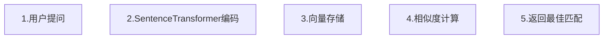

# 技术方案文档

使用Sentence-BERT(sBert) 专门为句子相似度任务优化的模型，使用起来更简单，效果也更好。

## 整体流程概述



## 核心技术步骤

### 1. 环境准备
首先需要安装必要的Python库,下载对应的模型

### 2. SentenceTransformer模型加载
```python
from sentence_transformers import SentenceTransformer
import numpy as np

# 加载预训练的中文SentenceTransformer模型
model = SentenceTransformer('sentence-transformers/paraphrase-multilingual-MiniLM-L12-v2')

# 也可以使用中文专用模型
# model = SentenceTransformer('uer/roberta-base-finetuned-chinanews-chinese')
```

### 3. 文本编码流程

#### 3.1 文本编码
```python

embedding = model.encode(text)
return embedding

# 批量编码
faq_questions = ["如何重置密码？", "账号登录失败怎么办？", "忘记密码怎么找回？"]
faq_embeddings = model.encode(faq_questions)

# 直接得到numpy数组，无需额外转换
faq_matrix = faq_embeddings
```

### 4. 相似度计算方案

### 4.1 多层次混合匹配策略
- 第一层：使用SentenceTransformer快速语义匹配
- 第二层：传统余弦相似度精细调优
- 第三层：编辑距离+关键词匹配兜底
- 匹配原则：按优先级顺序执行，达到任一层次阈值即返回结果

### 4.2 相似度融合计算
- 采用加权融合策略
- 根据业务场景动态调整各方法权重
- 设置early stopping机制，高置信度时提前终止计算

### 4.3 自适应阈值调节
- 基于历史匹配效果动态调整阈值
- 成功率>90%时提高阈值保证质量
- 成功率<60%时降低阈值提高召回率

### 4.4 结果反馈机制
- 匹配成功时记录用户满意度评分
- 低置信度结果自动进入人工复核流程
- 定期分析用户反馈数据优化匹配策略

## 进阶方案

### 1. 向量缓存
- FAQ向量可以预先计算并缓存
- 历史问题反馈较好的向量也可以缓存，避免重复计算
- 避免每次都要重新编码固定的FAQ内容

### 2. 批量处理
- 支持批量用户提问处理
- 提高系统吞吐量

### 3. 相似度索引
- 对于大量FAQ，可以使用Faiss等向量检索库
- 加速大规模相似度搜索

### 4. 质量保障机制
- 人工复核系统：建立人工审核队列，定期抽查匹配结果
- 异常检测：识别频繁匹配失败的用户查询

## 关键技术点总结

**SentenceTransformer编码**：将文本转换为向量表示
**语义相似度计算**：内置优化的相似度计算，比原始BERT效果更好
**阈值控制**：设置合适的相似度阈值保证准确性
**性能优化**：缓存预计算向量，达到阈值提前结束
**系统部署使用**：通过API方式调用
